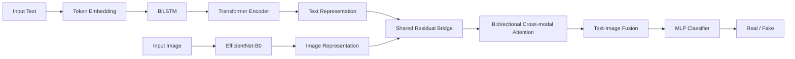

# multimodal-fake-news-detection

**A multimodal fake news detection model with a shared semantic bridge and bidirectional cross-modal attention.**

[](https://www.python.org/)
[](https://pytorch.org/)
[](#)
[](#)

This repository is organized as a public research project and as supplementary material for a paper or thesis. It records the model design, implementation, experiment scripts, ablation settings, result tables, and reproducibility notes for multimodal fake news detection.

## Abstract

Fake news on social media is often expressed through both text and images. Text-only models may overlook misleading or contradictory visual evidence, while image-only models cannot fully capture stance, claims, and contextual semantics in the text. This project studies how to jointly model textual content, visual evidence, and cross-modal consistency.

The proposed model combines a `BiLSTM + Transformer` text encoder, an `EfficientNet-B0` image encoder, a shared residual semantic bridge, and a bidirectional cross-modal attention module. The shared bridge performs coarse semantic alignment between text and image features, while the bidirectional attention block captures fine-grained interaction in both text-to-image and image-to-text directions.

Experiments are organized on three datasets: `Weibo`, `Gossip`, and `CFND`. The repository also includes baseline comparisons, unimodal comparisons, ablation studies, parameter analysis, and documentation for reproducing the reported results.

## Highlights

- **Paper-oriented repository**: README, experiment logs, model-to-code mapping, reproducibility notes, figure inventory, and table inventory are prepared as supplementary material.
- **Multimodal architecture**: the model combines sequence-level text modeling, visual semantic extraction, semantic bridging, and bidirectional cross-modal interaction.
- **Reproducible experiment entry points**: main training scripts are preserved for `CFND`, `Gossip`, and `Weibo`.
- **Systematic analysis**: the repository records main results, baseline comparisons, unimodal comparisons, ablations, and parameter sensitivity analysis.
- **Publication-aware documentation**: dataset redistribution limits and third-party code attribution are separated into dedicated documents.

## Method Overview



The corresponding code modules are documented in [docs/model_implementation.md](docs/model_implementation.md).

## Main Contributions

1. **Dual-path text representation**
   The text branch combines `BiLSTM` and `Transformer` so that the model can capture both local sequential context and global semantic dependency.

2. **Shared semantic bridge**
   A shared residual mapping is used to reduce the modality gap between textual and visual features before deeper fusion.

3. **Bidirectional cross-modal attention**
   The fusion block models both text-to-image and image-to-text interactions, helping the model capture consistency, complementarity, and conflict between modalities.

4. **Multi-dataset evaluation**
   The model is evaluated on Chinese and English multimodal fake news datasets, with baseline comparisons and ablation studies preserved for reproducibility.

## Results

### Main Comparison

| Dataset | Model | Accuracy | Fake F1 |
| --- | --- | ---: | ---: |
| CFND | Ours | **0.8489** | **0.8520** |
| CFND | Concat | 0.8403 | 0.8488 |
| CFND | MVAE | 0.8211 | 0.8272 |
| CFND | att-RNN | 0.8174 | 0.8251 |
| CFND | EANN-noadv | 0.8114 | 0.8236 |
| Weibo | Ours | **0.8432** | **0.8300** |
| Weibo | Concat | 0.8252 | 0.8051 |
| Weibo | EANN-noadv | 0.7936 | 0.7749 |
| Weibo | att-RNN | 0.7756 | 0.7536 |
| Weibo | MVAE | 0.7720 | 0.7393 |
| Gossip | TextOnly | 0.8728 | **0.9229** |
| Gossip | Ours | 0.8696 | 0.9225 |
| Gossip | EANN-noadv | 0.8678 | 0.9210 |
| Gossip | Concat | 0.8647 | 0.9182 |
| Gossip | MVAE | 0.8516 | 0.9108 |

The results suggest that the proposed fusion design is especially helpful on `CFND` and `Weibo`, where text-image consistency and visual evidence contribute more strongly. On `Gossip`, text-only modeling is already very strong, so multimodal fusion provides a smaller marginal gain.

Detailed experiment records are maintained in [docs/experiment_log.md](docs/experiment_log.md).

### Dataset Summary

| Dataset | Size | Real | Fake | Split | Notes |
| --- | ---: | ---: | ---: | --- | --- |
| Weibo | 9,527 | 4,779 | 4,748 | 6,777 / 754 / 1,996 | Chinese social media rumor dataset |
| Gossip | 12,840 | 2,581 | 10,259 | 9,009 / 1,001 / 2,830 | English entertainment news dataset |
| CFND | 26,664 | 16,394 | 10,270 | 15,997 / 5,333 / 5,334 | Chinese cross-domain fake news dataset |

Raw datasets are not redistributed in this repository. See [docs/dataset_statement.md](docs/dataset_statement.md).

## Reproduction

### Environment

Recommended environment:

| Item | Version |
| --- | --- |
| Python | 3.10+ |
| PyTorch | 2.5+ |
| CUDA | 12.x, if using GPU |
| GPU memory | 24 GB recommended; reduce batch size for smaller GPUs |

Install dependencies:

```bash
python -m venv .venv
source .venv/bin/activate
pip install --upgrade pip
pip install -r requirements.txt
```

Windows PowerShell:

```powershell
python -m venv .venv
.\.venv\Scripts\Activate.ps1
python -m pip install --upgrade pip
pip install -r requirements.txt
```

Optional FaKnow baseline dependencies:

```bash
pip install -r requirements-faknow.txt
```

### Data Preparation

Before running experiments, obtain the datasets from their original sources and check the dataset paths in the corresponding training scripts:

- `CFG.dataset_root`
- `CFG.processed_dir`
- `CFG.train_csv`
- `CFG.val_csv`
- `CFG.test_csv`
- `CFG.save_root`

The label convention used by the experiments is `0 = real` and `1 = fake`. Evaluation treats `fake` as the positive class.

### Run Main Experiments

Main experiment scripts are located in:

```text
code/01_我的实验代码_主实验+对比+消融/对比实验代码/主实验并入代码/
```

Run:

```bash
python final_train_CFND.py
python final_train_gossip.py
python final_train_weibo.py
```

For full details, see [docs/reproducibility.md](docs/reproducibility.md).

## Code Map

The main implementation is represented by the following modules in the `final_train_*` scripts:

| Paper component | Code module |
| --- | --- |
| Hyperparameter and path configuration | `CFG = SimpleNamespace(...)` |
| Text encoder | `LSTMTransformerEncoder` |
| Image encoder | `ImageEncoder` |
| Shared semantic bridge | `SharedResidualBridge` |
| Bidirectional cross-modal attention | `BiDirectionalCrossAttentionBlock` |
| Fusion module | `LightweightBiCrossAttentionFusion` |
| End-to-end classifier | `MultiModalModel` |
| Training loop | `train_one_epoch` |
| Evaluation | `evaluate`, `compute_metrics_from_probs` |

Representative entry file:

```text
code/01_我的实验代码_主实验+对比+消融/对比实验代码/主实验并入代码/final_train_CFND.py
```

## Repository Structure

```text
.
|-- README.md
|-- CITATION.cff
|-- requirements.txt
|-- requirements-faknow.txt
|-- docs/
|   |-- dataset_statement.md
|   |-- experiment_log.md
|   |-- figures.md
|   |-- model_implementation.md
|   |-- paper_outline.md
|   |-- reproducibility.md
|   |-- repository_checklist.md
|   |-- tables.md
|   `-- third_party_code.md
`-- code/
    |-- 01_我的实验代码_主实验+对比+消融/
    |-- 03_我的可视化与分析代码/
    `-- 04_第三方基线与参考实现/
```

## Supplementary Materials

| Document | Purpose |
| --- | --- |
| [docs/model_implementation.md](docs/model_implementation.md) | Maps paper modules to code modules |
| [docs/reproducibility.md](docs/reproducibility.md) | Environment, dataset paths, and run instructions |
| [docs/experiment_log.md](docs/experiment_log.md) | Main results, comparisons, ablations, and parameter analysis |
| [docs/figures.md](docs/figures.md) | Figure inventory and visualization sources |
| [docs/tables.md](docs/tables.md) | Table sources for README, paper, and defense materials |
| [docs/dataset_statement.md](docs/dataset_statement.md) | Dataset access and redistribution notes |
| [docs/third_party_code.md](docs/third_party_code.md) | Third-party baseline and reference implementation notes |
| [docs/repository_checklist.md](docs/repository_checklist.md) | Public release checklist |

## Publication Notes

This repository is suitable as a paper or thesis companion repository, but a final public release should still confirm:

1. dataset download or access instructions
2. third-party code source links and license compatibility
3. final high-resolution model architecture figures
4. full metric provenance from each training run
5. the final repository license

## Citation

If this repository is useful for your work, please cite the associated paper, thesis, or repository record. A citation template is provided in [CITATION.cff](CITATION.cff).

## License

No open-source license has been selected yet. Until a license is added, reuse rights are not clearly granted.

Recommended choices:

- `MIT` for broad code reuse
- `Apache-2.0` for broad reuse with an explicit patent grant
- `All rights reserved` if this repository is only intended as a research disclosure or supplementary archive
